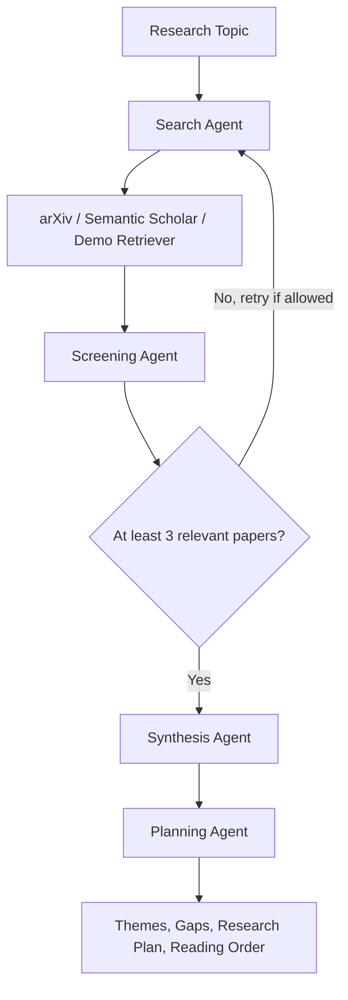

# Agentic Literature Review System

A multi-agent AI system that finds academic papers, screens them for relevance, synthesizes themes, identifies research gaps, and recommends a beginner-friendly reading order.

This repository is a portfolio-ready clean-room implementation based on a CIS 600 applied agentic AI project. It keeps the original multi-agent idea, but reorganizes the code into a maintainable Python package with lightweight dependencies, deterministic fallback behavior, tests, and an offline demo mode.

## Highlights

- Four-agent workflow: Search, Screening, Synthesis, and Planning.
- Multi-source retrieval from arXiv and Semantic Scholar.
- Groq-powered LLM mode for query generation, scoring, synthesis, and planning.
- Offline `--demo-data` mode for reliable demos without API keys or rate limits.
- Optional LangGraph orchestration with a sequential fallback.
- Lightweight evaluation metrics for pipeline completion, retrieval coverage, source diversity, and relevance.
- JSON export for downstream analysis or UI integration.

## Architecture



## Tech Stack

| Area | Implementation |
|---|---|
| Language | Python 3.11+ |
| Orchestration | Optional LangGraph, built-in sequential fallback |
| LLM | Groq OpenAI-compatible chat API |
| Retrieval | arXiv API, Semantic Scholar API, offline sample retriever |
| Packaging | `src/` layout with `pyproject.toml` |
| Testing | `unittest` |

## Project Structure

```text
.
|-- main.py
|-- pyproject.toml
|-- requirements.txt
|-- requirements-langgraph.txt
|-- examples/
|   `-- sample_output.json
|-- src/
|   `-- agentic_lit_review/
|       |-- agents/
|       |   |-- search.py
|       |   |-- screening.py
|       |   |-- synthesis.py
|       |   `-- planning.py
|       |-- retrievers/
|       |   |-- arxiv.py
|       |   |-- semantic_scholar.py
|       |   |-- sample.py
|       |   `-- dedupe.py
|       |-- cli.py
|       |-- evaluation.py
|       |-- graph.py
|       |-- llm.py
|       |-- models.py
|       |-- state.py
|       `-- text_utils.py
`-- tests/
    `-- test_reconstruction.py
```

## Quick Start

Run a deterministic offline demo. This does not need API keys, network access, or third-party packages:

```powershell
py -3 main.py "zero-shot learning" --no-llm --demo-data --evaluate
```

Save the result as JSON:

```powershell
py -3 main.py "zero-shot learning" --no-llm --demo-data --evaluate --json examples/sample_output.json
```

## LLM Mode

Create an environment file:

```powershell
Copy-Item .env.example .env
notepad .env
```

Set your Groq key:

```text
GROQ_API_KEY=your_key_here
GROQ_MODEL=llama-3.3-70b-versatile
```

Run the live system:

```powershell
py -3 main.py "retrieval augmented generation" --evaluate
```

If arXiv or Semantic Scholar returns `HTTP Error 429`, wait a few minutes and retry with fewer calls:

```powershell
py -3 main.py "retrieval augmented generation" --max-results 3 --max-search-iterations 1
```

## Optional Environment Setup

The base project has no required third-party runtime dependencies for the offline demo. For a clean virtual environment:

```powershell
py -3 -m venv .venv
.\.venv\Scripts\Activate.ps1
py -3 -m pip install -r requirements.txt
```

Install optional LangGraph support only in a clean environment:

```powershell
py -3 -m pip install -r requirements-langgraph.txt
```

## Example Output

The system produces:

- Ranked screened papers with relevance scores.
- Cross-paper themes.
- Research gaps.
- A structured research plan.
- A recommended reading order with reasons.
- Lightweight evaluation metrics.

See `examples/sample_output.json` for a reproducible offline run.

## Testing

```powershell
$env:PYTHONPATH="src"
py -3 -m unittest discover -s tests
```

## What This Demonstrates

This project is designed to show practical agent engineering skills:

- Decomposing a research workflow into specialized agents.
- Managing shared state across an agent pipeline.
- Combining live tools with deterministic fallbacks.
- Handling API failures and rate limits gracefully.
- Producing structured outputs that can be evaluated and reused.
